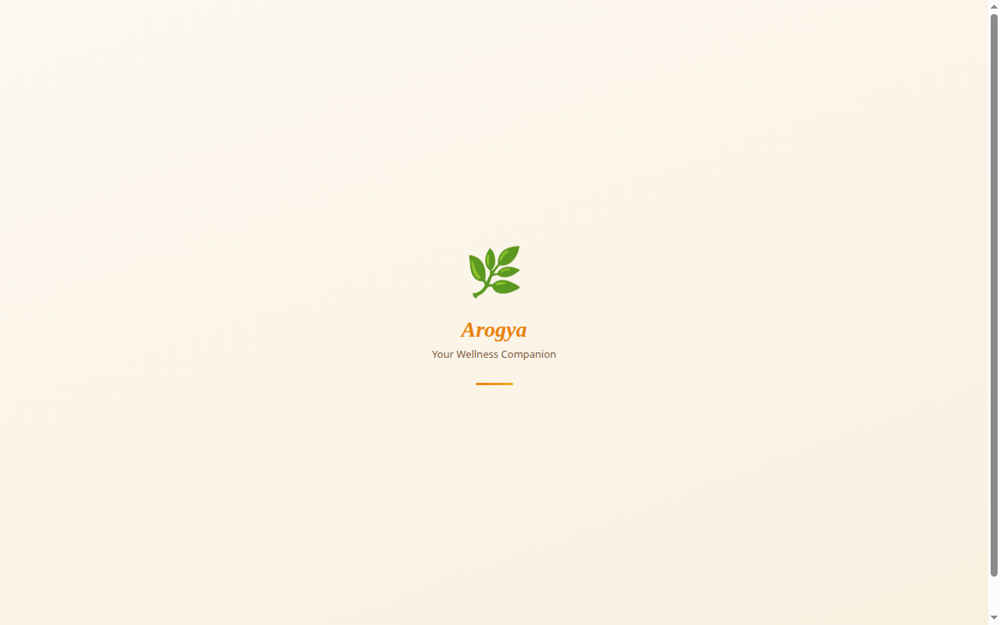

# Arogya — Your Wellness Companion 🌿

## Screenshot




[](LICENSE)
[](https://nodejs.org)
[](#how-it-works)


A calm, private, AI-powered wellness companion. Pick a body area, answer a few gentle questions (symptoms → duration → severity), and get natural home-remedy suggestions — with safety guardrails at every step.

**Not a medical service.** Arogya never diagnoses, never suggests medication, and always redirects emergencies to real help.

---

## Features

- 🗨️ **Guided wellness chat** — structured flow: body area → symptoms → duration → severity → remedies → summary
- 🌿 **Natural remedies only** — rest, hydration, steam, honey, ginger, herbal teas… never medication
- 🛡️ **Safety-first**
  - Disclaimer gate (two explicit checkboxes) before the first chat
  - Client-side crisis detection → full-screen support screen (988, Crisis Text Line, IASP directory, 911/999/112)
  - Emergency-symptom detection (chest pain, stroke, seizure, …) → immediate "call emergency services" card
  - Calm, non-alarming language for serious symptoms + "see a doctor" nudges
- 🔒 **Privacy-first** — anonymous, no accounts, no storage; the backend logs request counts only, never message contents
- 📱 **Installable PWA** — real `manifest.json`, icons, offline-aware service worker, splash screen
- ♿ **Accessible** — skip link, focus-visible rings, ARIA labels/live regions, keyboard-operable modal, `prefers-reduced-motion` support, AA-hardened text contrast
- 🤖 **Free AI out of the box** — runs on the keyless Pollinations text API ($0, no signup); swap to Anthropic or any OpenAI-compatible endpoint with env vars
- ✨ **Serene ambience** — floating particle glow, a slow breathing gradient, and soft WebAudio chimes (mutable, one tap) — calm, never noisy

## How it works

```
┌──────────────┐      POST /api/chat       ┌──────────────────┐     OpenAI-style      ┌──────────────┐
│              │  { messages: [...] }  ──▶ │                  │  /chat/completions ─▶ │              │
│  Static      │                           │  Express API     │                       │  AI provider │
│  frontend    │  ◀── { reply: {...} } ──  │  (this repo)     │  ◀── strict JSON ──   │  (Pollinations│
│  (any host)  │   strict-JSON envelope    │                  │                       │   free / keyless│
└──────────────┘                           └──────────────────┘                       │  or Anthropic │
       ▲                                              │                              └──────────────┘
       │ serves index.html + app.js + sw.js           │ helmet · rate-limit · validation ·
       │ (no build step)                              │ timeout+retry · JSON-repair fallback
```

The AI must return **one strict-JSON object** per reply (`message`, `quickReplies`, `stage`, `currentStep`, `collectedSymptoms`, `remedies`, `doctorNote`, `warningSigns`, `isSummary`, `showSoftCrisis`, `softCrisisMessage`). Free models are loose with JSON, so the backend extracts with multi-strategy parsing, attempts one model-side repair, and otherwise returns a warm fallback envelope — the user never sees a raw error.

## Quickstart

### Backend (Node ≥ 18)

```bash
cd backend
npm install
cp .env.example .env   # defaults already work — no key needed
npm start              # → http://localhost:3000
```

Check it's alive:

```bash
curl localhost:3000/health
curl localhost:3000/ready
curl -X POST localhost:3000/api/chat \
  -H 'Content-Type: application/json' \
  -d '{"messages":[{"role":"user","content":"hi"}]}'
```

### Frontend (zero build — just serve the folder)

```bash
cd frontend
npx serve .            # or: python3 -m http.server 8080
# open http://localhost:8080
```

> Do not open `index.html` via `file://` — the service worker and `fetch()` calls require http(s).

**Point the frontend at your backend:** edit `frontend/config.js`:

```js
window.AROGYA_CONFIG = { API_URL: "https://your-backend.onrender.com/api/chat" };
```

The default `"/api/chat"` works when frontend and backend share an origin (or a reverse proxy routes `/api/*` to the backend).

## Environment variables

| Variable | Default | Required | Description |
|---|---|---|---|
| `PORT` | `3000` | no | Port the API listens on (Render sets this automatically) |
| `AI_PROVIDER` | `openai-compatible` | no | `openai-compatible` or `anthropic` |
| `AI_API_KEY` | _(empty)_ | only for `anthropic` | Provider key. **Optional for `openai-compatible`** — the default Pollinations endpoint works keyless. If set, sent as `Authorization: Bearer` |
| `AI_MODEL` | `openai` / `claude-sonnet-4-5` | no | Model to request (provider default if unset) |
| `AI_BASE_URL` | `https://text.pollinations.ai/openai` | for `openai-compatible` | Base URL; `/chat/completions` is appended automatically |
| `AI_MAX_TOKENS` | `900` | no | Max tokens per AI reply |
| `AI_TIMEOUT_MS` | `60000` | no | Upstream timeout (free tiers can be slow) |
| `FRONTEND_URL` | _(empty = open)_ | no | Comma-separated allowed origins for CORS. **Set this in production** — the server logs a warning when it's open |
| `RATE_LIMIT_WINDOW_MS` | `900000` | no | Rate-limit window (15 min) |
| `RATE_LIMIT_MAX` | `120` | no | Max `POST /api/chat` requests per IP per window |
| `TRUST_PROXY` | `1` | no | Trust proxy hops for correct client IPs behind Render/Heroku-style hosts |

## API contract

### `POST /api/chat`

Request:

```json
{ "messages": [{ "role": "user", "content": "hi" }] }
```

- `messages`: non-empty array, ≤ 50 entries, ≤ 4000 chars each, ≤ 20000 chars total. Roles: `user` | `assistant`.
- Validation failures → `400 { "error": "..." }`. Rate limited → `429`.

Success → `200`:

```json
{
  "reply": {
    "message": "Hey! What's been bothering you today?",
    "quickReplies": ["I have a headache", "Stomach issues"],
    "stage": "questioning",
    "currentStep": "area",
    "collectedSymptoms": [],
    "remedies": [{ "icon": "🌿", "title": "Ginger tea", "detail": "…", "source": "healthline.com" }],
    "doctorNote": null,
    "warningSigns": [],
    "isSummary": false,
    "showSoftCrisis": false,
    "softCrisisMessage": null
  }
}
```

- `stage`: `questioning` | `remedy` | `doctor`; `currentStep`: `area` | `symptoms` | `duration` | `severity` | `remedy`.
- `degraded: true` may accompany `reply` when the model needed a JSON repair — the UI can ignore it; it's for your logs.
- Upstream failures → `502/504 { "error": "<user-safe message>" }` (never leaks provider internals).

### `GET /health` → `200 { "ok": true, "uptime": 123 }`
### `GET /ready` → `200 { "ready": true, "provider": "…", "model": "…" }` or `503 { "ready": false, "reason": "…" }`
### `GET /` → `200 { "ok": true, "app": "Arogya backend", "version": "2.0.0", "status": "running" }`

## Deploying on Render (free tier)

**Backend — Web Service**
1. New → Web Service → point at this repo.
2. Root Directory: `backend` · Build Command: `npm install` · Start Command: `npm start`.
3. Environment: `AI_PROVIDER=openai-compatible` (default — nothing else needed), `FRONTEND_URL=https://<your-frontend>.onrender.com`, `TRUST_PROXY=1`.
4. Note the service URL, e.g. `https://arogya-backend.onrender.com`.

**Frontend — Static Site**
1. New → Static Site → point at this repo.
2. Root Directory: `frontend` · Build Command: *(leave blank)* · Publish Directory: `.`
3. In `frontend/config.js`, set `API_URL` to `https://arogya-backend.onrender.com/api/chat`, commit, and push so Render redeploys.

**Before launch checklist**
- [ ] `FRONTEND_URL` set on the backend (CORS locked down)
- [ ] `frontend/config.js` points at the real backend URL
- [ ] Replace `your-arogya-domain.example` in `index.html` (og/twitter tags), `robots.txt`, `sitemap.xml` with the real domain
- [ ] Confirm the AI provider responds: `curl -X POST <backend>/api/chat …` returns a `reply`
- [ ] Try the crisis phrases ("I want to die") and an emergency phrase ("chest pain") — verify the safety screens appear

> **Provider status note (2026-10-08):** Pollinations' text API was returning transient server-side `ENOSPC` errors during development — their inference node, not this code. If it persists, point `AI_BASE_URL`/`AI_MODEL` at any other OpenAI-compatible endpoint; no code changes needed.

**Custom domain:** any registrar works — point DNS at Render (or your static host) and update the three placeholder spots above plus `config.js` if the backend host changes.

## Project structure

```
arogya/
├── frontend/            # zero-build static app (deploy anywhere)
│   ├── index.html       # shell, meta/OG tags, splash, script includes
│   ├── config.js        # ← set your backend URL here
│   ├── app.js           # React 18 + in-browser JSX (all screens)
│   ├── styles.css       # design system (tokens, a11y, responsive)
│   ├── sw.js            # offline-aware service worker
│   ├── manifest.json    # PWA manifest
│   ├── robots.txt / sitemap.xml
│   ├── og-image.png
│   └── icons/           # favicon.svg, PNG icons
├── backend/             # Express API
│   ├── server.js        # app: providers, validation, retry, JSON repair, hardening
│   ├── package.json     # pinned-ish deps, node >= 18
│   └── .env.example
├── LICENSE              # MIT © 2026 Vivek Nair
├── SECURITY.md
└── CONTRIBUTING.md
```

## Contributing

See [CONTRIBUTING.md](CONTRIBUTING.md). TL;DR: keep it free, keep it calm, keep it safe — safety-prompt changes get extra review.

## Security

See [SECURITY.md](SECURITY.md) for reporting vulnerabilities and how data is handled.

## License

MIT © 2026 Vivek Nair — see [LICENSE](LICENSE).

---

**Crafted by [Vivek Nair](https://github.com/vivekn4) · VN**
